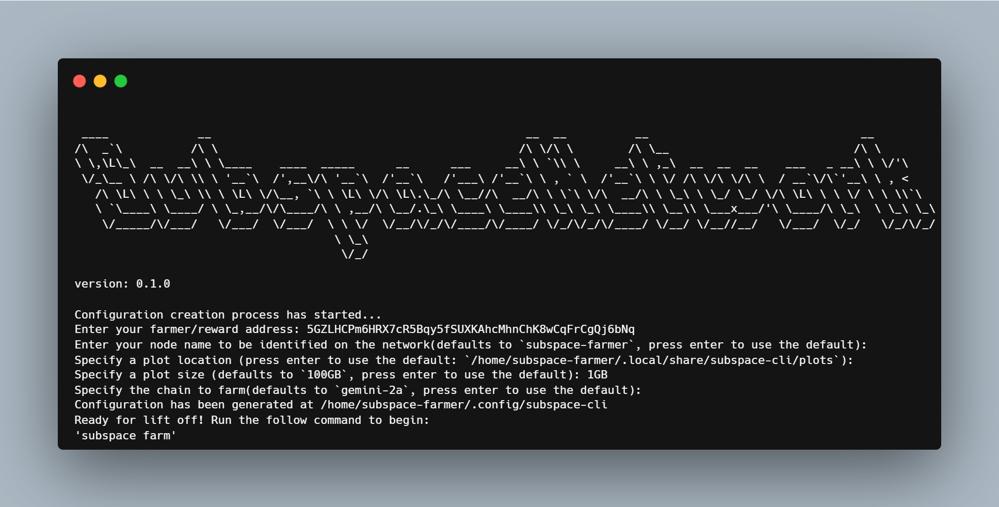

# Subspace-CLI

is a great tool that heavily simplifies the terminal workflow of the farming process. \\
Instead of running a terminal instance for the farmer, and running another terminal instance for the node, now you can run a SINGLE terminal instance to farm!

## How to Use (commands)
1. download the executable
2. in your terminal, change your directory to where you download the file for example: if you downloaded your file to your `Downloads` folder, `cd Downloads`)
3. run `./subspace-cli init` -> this will initialize your config file, which will store the necessary information for you to farm.
4. run `./subspace-cli farm` -> this will start farming. Yes, it is that simple! Enjoy!

## Other commands
- `wipe` -> This is a dangerous one. If you want to delete everything and start over, this will permanently delete your plots and your node data (this will not erase any rewards you have gained, don't worry).
- `info` -> This will show info for your farming.

## Farming in the background (macos/linux)
You want to farm, but as a background task/service? You can do so via `screen`!

Follow the below guide:
1. `screen -S farming` -> creates a new screen session with the name *farming*.
2. `./subspace-cli init` -> initializes subspace cli (you can skip this step if you already have an initialization). 
3. `./subspace-farm farm` -> starts the farming :)
4. press the key combination: `CTRL+a`, replaced by: `d` -> this will detach your process (it will be running in the background).

That's it, you should be back to your terminal, with *subspace farming* running in the background as a session.

If you want to re-attach your farming session, run the command: `screen -r farming`.
Screen is a great command, you can learn more about it using the command `screen -h`.

If you ever want to delete/kill your farming session, enter the command: `screen -S farming -X quit`.
