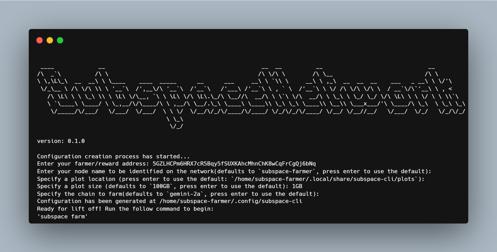

<div align="center">

# Pulsar

Pulsar simplifies the farming process on Subspace Network.

[](https://github.com/subspace/pulsar/actions/workflows/ci-tests.yml)
[](https://github.com/subspace/pulsar/actions/workflows/rustdoc.yml)
[](https://github.com/subspace/pulsar/releases)



</div>

---

Instead of running a terminal instance for the farmer, and running another terminal instance for the node, now you can run a SINGLE terminal instance to farm!

## Build

Ensure the [pre-requisites](https://github.com/subspace/subspace/blob/main/docs/development.md#pre-requisites).

And then run:

```sh
$ cargo build
```

> Use `--release` flag for a release build and optimized binary - `./target/release/pulsar`

## How to Use (commands)

1. download the executable from [releases](https://github.com/subspace/pulsar/releases)
2. in your terminal, change your directory to where you download the file for example: if you downloaded your file to your `Downloads` folder, `cd Downloads`)
3. we will address your executable name as `pulsar`, change the below commands accordingly to your full executable name.
4. run `./pulsar init` -> this will initialize your config file, which will store the necessary information for you to farm.
5. run `./pulsar farm` -> this will start farming. Yes, it is that simple! Enjoy!

## Other commands

- `wipe` -> This is a dangerous one. If you want to delete everything and start over, this will permanently delete your plots and your node data (this will not erase any rewards you have gained, don't worry).
- `info` -> This will show info for your farming.

## Daemonizing the Process (Moving it to the Background)

In some instances, you may want to move the farming process to the background. Tools like [`screen`](https://www.gnu.org/software/screen/manual/screen.html) and [`tmux`](https://github.com/tmux/tmux) can help manage this.


### Example with `tmux`

```sh
$ tmux -S farming
```

This will create a new `tmux` session using a socket file named `farming`.

Once the tmux session is created, you can go ahead and run the farming process.

```sh
$ ./pulsar farm
```

Once it's running, you can detach the process by pressing `CTRL+b d` (read more about [detaching a sessions](https://linuxhint.com/detach-session-tmux/))

That's it, you should be back to your terminal, with _subspace farming_ running in the background as a session.

To re-attach to your session, use tmux:

```sh
$ tmux -S farming attach
```

If you ever want to delete/kill your farming session, enter the command:

```sh
tmux kill-session -t farming
```

### Example with `screen`

```sh
screen -S farming
```

This will create a new `screen` session.

```sh
./pulsar farm
```

Once it's running, you can detach the process by pressing `CTRL+d a`.

To re-attach it to your current session:

```sh
screen -r farming
```

If you ever want to delete/kill your farming session, enter the command:

```sh
screen -S farming -X quit
```
